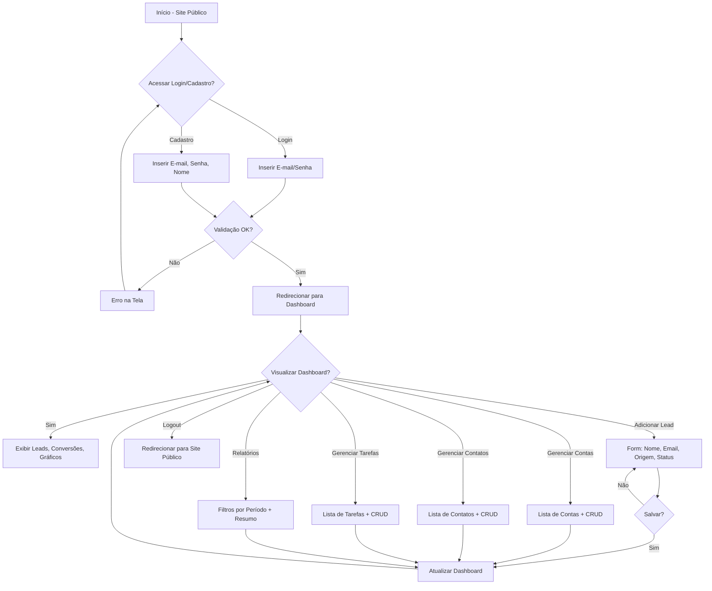
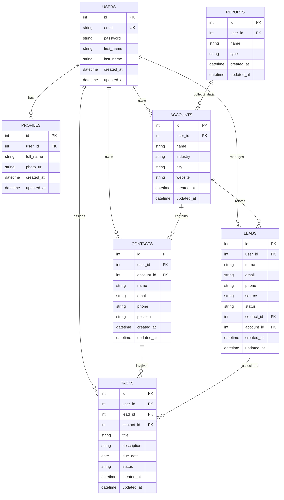

# Documento de Requisitos do Produto (PRD) - JL CRM

## Visão geral

O JL CRM é um sistema de gestão de relacionamento com clientes (Customer Relationship Management) desenvolvido com Python e Django, focado em simplicidade e usabilidade. Ele permite que usuários registrem leads, gerenciem contas e contatos, acompanhem tarefas e visualizem métricas comerciais em um dashboard intuitivo. O projeto adota uma abordagem full-stack com templates Django e TailwindCSS para um design moderno, responsivo e de tema escuro. A autenticação usa o sistema nativo do Django, com login via e-mail. O banco de dados é SQLite, e a estrutura é modularizada em apps Django para isolamento de responsabilidades. O escopo inicial é enxuto, sem Docker ou testes, priorizando funcionalidade básica.

## Sobre o produto

JL CRM é uma aplicação web para gestão comercial e relacionamento com clientes, construída para ser acessível e sem complexidades desnecessárias. Ele oferece um site público de apresentação com opções de cadastro e login, redirecionando usuários autenticados para um dashboard central. As entidades principais incluem usuários, perfis, leads, contas, contatos, tarefas e relatórios. Todo o conteúdo da interface é em português brasileiro, enquanto o código fonte é em inglês, seguindo PEP 8 e usando aspas simples.

## Propósito

O propósito do JL CRM é fornecer uma ferramenta simples e eficaz para que equipes comerciais gerenciem seus relacionamentos com clientes, promovendo processos organizados por meio de rastreamento de leads, conversões, follow-ups e visualizações básicas. Ele visa reduzir a sobrecarga cognitiva com um design consistente e intuitivo, ajudando usuários a tomarem decisões informadas sem a necessidade de ferramentas complexas ou integrações externas.

## Público alvo

- Pequenas e médias empresas (5-50 funcionários) que buscam organizar processos comerciais.
- Equipes de vendas, atendimento e pós-venda interessadas em controle básico de relacionamento.
- Gestores comerciais que precisam de visibilidade sobre pipeline e conversões.
- Usuários iniciantes em sistemas CRM, que preferem interfaces simples e em português brasileiro.
- Residentes no Brasil, devido ao foco em português e processos comerciais locais.

## Objetivos

- Permitir cadastro e login via e-mail em menos de 1 minuto.
- Oferecer um dashboard com resumo de leads, conversões recentes e métricas simples.
- Garantir que 80% das ações (cadastro de lead, criação de tarefa) sejam concluídas em 3 cliques ou menos.
- Manter o sistema leve e performático, com carregamento de páginas abaixo de 2 segundos.
- Evoluir para sprints finais com testes e containerização, mas priorizar MVP funcional.

## Requisitos funcionais

- **Autenticação**: Cadastro e login via e-mail usando Django Auth nativo. Site público com páginas de login/cadastro redirecionando para dashboard.
- **Dashboard Principal**: Após login, exibe total de leads, conversões recentes (últimas 10), gráfico de funil por estágio e métricas de tarefas pendentes.
- **Gerenciamento de Leads**: CRUD para leads (nome, email, telefone, origem, status).
- **Gerenciamento de Contas**: CRUD para empresas (nome, indústria, cidade, site).
- **Gerenciamento de Contatos**: CRUD para pessoas vinculadas a contas (nome, email, telefone, cargo).
- **Gerenciamento de Tarefas**: CRUD para atividades (título, descrição, data vencimento, status, vinculação a lead/contato).
- **Perfis de Usuário**: Extensão do modelo User com campos adicionais (nome completo, foto opcional).
- **Relatórios Básicos**: Filtros por período (mês/ano) e resumo por origem de lead e taxa de conversão.
- **Validações**: Campos obrigatórios em forms, emails únicos, datas válidas.

### Flowchart mermaid com os fluxos de UX

## Requisitos não-funcionais

- **Performance**: Páginas carregam em <2s; consultas SQL otimizadas para <100ms.
- **Segurança**: Autenticação Django nativa; CSRF e XSS protegidos; dados sensíveis (e-mails) hashed.
- **Usabilidade**: Design responsivo (mobile-first); acessibilidade básica (ARIA labels em forms).
- **Escalabilidade**: Inicialmente SQLite; modular para migração futura para PostgreSQL.
- **Manutenibilidade**: Código em apps isolados; signals em signals.py; CBVs preferenciais.
- **Idioma**: Interface 100% em PT-BR; código em inglês.
- **Compatibilidade**: Browsers modernos (Chrome, Firefox, Safari últimos 2 anos).

## Arquitetura técnica

### Stack

- **Backend**: Python 3.13+, Django 5.x (full-stack com CBVs).
- **Frontend**: Django Template Language + TailwindCSS (CDN ou estático).
- **Banco de Dados**: SQLite (padrão Django).
- **Autenticação**: Django Auth (customizado para e-mail como USERNAME_FIELD).
- **Outros**: Sem Docker/testes iniciais; signals em signals.py por app.

### Estrutura de dados com schemas em formato mermaid

## Design system

O design system é baseado em TailwindCSS, integrado via CDN nos templates base. Tema escuro com gradientes harmônicos (azul-indigo para primárias, cinza escuro para fundo). Todas as telas herdam de um template base (`base.html`) com header (logo, menu navegação, logout), sidebar (links para dashboard, leads, contas, contatos, tarefas, relatórios) e footer simples. Layout responsivo com grid flexível.

- **Cores Primárias**: 
  - Primária: `bg-gradient-to-r from-blue-600 to-indigo-700` (botões de ação).
  - Secundária: `bg-green-600` (ênfase em conversões).
  - Erro: `bg-red-600`, Sucesso: `bg-green-600`.
- **Cores de Fundo**: 
  - Fundo Principal: `bg-slate-900` (escuro).
  - Cards: `bg-slate-800` com borda `border-slate-700`.
  - Gradiente Hero: `bg-gradient-to-br from-slate-900 via-slate-800 to-slate-700`.
- **Padrão de Botões**: 
  - Primário: `<button class="bg-gradient-to-r from-blue-600 to-indigo-700 hover:from-blue-700 hover:to-indigo-800 text-white px-4 py-2 rounded-md shadow-lg transition">Salvar</button>`.
  - Secundário: `<button class="bg-slate-700 hover:bg-slate-600 text-white px-4 py-2 rounded-md">Cancelar</button>`.
- **Inputs e Forms**: 
  - Input: `<input class="w-full bg-slate-800 border border-slate-700 rounded-md px-3 py-2 text-white placeholder-gray-400 focus:outline-none focus:ring-2 focus:ring-blue-500">`.
  - Form: Wrapper com `bg-slate-800 p-6 rounded-lg shadow-md`.
- **Grids**: 
  - Layout Principal: `
` (sidebar 1 col, conteúdo 3 cols em desktop).
- **Menus**: 
  - Navbar: `<nav class="bg-slate-800 p-4 flex justify-between">` com links `text-white hover:text-blue-400`.
  - Sidebar: `<aside class="bg-slate-700 w-64 p-4">` com lista vertical `space-y-2`.
- **Fontes**: 
  - Principal: `font-sans` (system-ui via Tailwind), tamanhos: h1 `text-3xl font-bold`, body `text-base`.

Templates usam `` para Tailwind via ``.

## User stories

### Épico 1: Autenticação e Onboarding
- Como usuário novo, quero me cadastrar via e-mail para acessar o sistema.
- Como usuário existente, quero logar via e-mail para entrar no dashboard.
- Critérios de Aceite: 
  - Formulário de cadastro valida e-mail único e senha forte.
  - Login falha com credenciais inválidas, redireciona com mensagem de erro.
  - Após login, redireciona para /dashboard/.
  - Logout limpa sessão e volta ao site público.

### Épico 2: Dashboard e Visualizações
- Como usuário logado, quero ver resumo de leads e conversões no dashboard.
- Critérios de Aceite: 
  - Exibe total de leads, últimas 10 conversões em tabela.
  - Gráfico de funil (usando Chart.js básico) por estágio de lead.
  - Responsivo, atualiza em tempo real após ações.

### Épico 3: Gerenciamento de Leads
- Como usuário, quero adicionar/editar/excluir leads.
- Critérios de Aceite: 
  - Lista paginada de leads com filtro por status e origem.
  - Form com validação de email único.
  - Conversão de lead em conta e contato.

### Épico 4: Gerenciamento de Contas e Contatos
- Como usuário, quero criar contas e vincular contatos.
- Critérios de Aceite: 
  - CRUD para contas com campos de empresa.
  - Contatos associados a contas via ForeignKey.
  - Lista de contatos mostra empresa relacionada.

### Épico 5: Gerenciamento de Tarefas
- Como usuário, quero criar tarefas vinculadas a leads ou contatos.
- Critérios de Aceite: 
  - CRUD para tarefas com data de vencimento.
  - Filtros por status (pendente, concluída, cancelada).
  - Dashboard exibe tarefas vencidas.

### Épico 6: Relatórios
- Como usuário, quero filtrar relatórios por período.
- Critérios de Aceite: 
  - Tabela/resumo por origem de lead e taxa de conversão.
  - Exportação básica para CSV (opcional em sprint final).

## Métricas de sucesso

- **KPIs de Produto**: Taxa de retenção semanal >70%; Tempo médio de sessão >5min; Taxa de conversão de leads >20%.
- **KPIs de Usuário**: Número de usuários ativos (logins/mês) >30 no MVP; NPS >7/10 via feedback simples.
- **KPIs Técnicos**: Tempo de carregamento <2s (medido via browser devtools); Erros de autenticação <1%.
- **KPIs de Engajamento**: Leads cadastrados por usuário >10/semana; Tarefas criadas >5/semana.

## Risco e mitigações

- **Risco: Vazamento de dados sensíveis (e-mails, contatos)**. Mitigação: Usar autenticação Django hashed; auditoria manual de código; educar usuários sobre senhas fortes.
- **Risco: Performance lenta com SQLite em crescimento**. Mitigação: Otimizar queries com select_related; monitorar via Django debug toolbar; planejar migração para Postgres em v2.
- **Risco: Design inconsistente**. Mitigação: Template base obrigatório; revisão de PRs para adesão ao design system.
- **Risco: Atraso em sprints por over-engineering**. Mitigação: Definir escopo granular; reuniões semanais curtas; priorizar MVP sem features extras.
- **Risco: Baixo engajamento inicial**. Mitigação: Onboarding guiado; e-mails de boas-vindas; métricas semanais.

## Lista de tarefas

### Sprint 1: Setup Inicial e Autenticação (Semana 1-2)
- [X] Configurar projeto Django base
  - [X] Criar virtualenv e instalar Django 5.x via pip.
  - [X] Executar `django-admin startproject core .` e ajustar settings.py para apps (accounts, contacts, core, leads, profiles, tasks, users, reports).
  - [ ] Configurar LANGUAGE_CODE='pt-br' e TIME_ZONE='America/Sao_Paulo' em settings.py.
  - [X] Adicionar apps instalados em INSTALLED_APPS.
- [ ] Customizar modelo User para e-mail
  - [ ] Em users/models.py, subclass AbstractUser com USERNAME_FIELD='email' e REQUIRED_FIELDS=[].
  - [ ] Em users/admin.py, registrar User customizado.
  - [ ] Criar migração inicial com `python manage.py makemigrations users` e `migrate`.
- [ ] Implementar views e templates de autenticação
  - [ ] Em users/views.py, criar CBV LoginView e SignupView usando CreateView para User.
  - [ ] Configurar urls.py em core e users para /login/, /signup/, /logout/.
  - [ ] Criar templates base.html com Tailwind CDN, header e footer escuros.
  - [ ] Criar login.html e signup.html com forms em PT-BR, inputs Tailwind e botão gradiente.
- [ ] Site público
  - [ ] Em core/views.py, criar TemplateView para home pública com links para login/signup.
  - [ ] Template home.html com hero gradiente e chamadas para ação.

### Sprint 2: Perfis e Dashboard Básico (Semana 3)
- [ ] Modelo Profile
  - [ ] Em profiles/models.py, criar Profile com OneToOneField para User, full_name, photo.
  - [ ] Adicionar created_at/updated_at via mixin ou auto_now.
  - [ ] Makemigrations e migrate para profiles.
- [ ] Signal para criar Profile automático
  - [ ] Em profiles/signals.py, post_save para User criando Profile.
  - [ ] Em profiles/apps.py, importar signals em ready().
- [ ] Dashboard View
  - [ ] Em core/views.py, LoginRequiredMixin + TemplateView para /dashboard/.
  - [ ] Template dashboard.html com grid Tailwind, seções para leads, conversões e gráficos interativos.
  - [ ] Adicionar menu sidebar com links para seções futuras.

### Sprint 3: Contas (Semana 4)
- [ ] Modelo Account
  - [ ] Em accounts/models.py, Account com ForeignKey User, name, industry, city, website.
  - [ ] Adicionar created_at/updated_at.
  - [ ] Makemigrations e migrate.
- [ ] Admin para Account
  - [ ] Em accounts/admin.py, registrar Account com list_display e filters.
- [ ] CRUD Views para Accounts
  - [ ] Em accounts/views.py, ListView, CreateView, UpdateView, DeleteView com LoginRequiredMixin.
  - [ ] Forms em forms.py com ModelForm, validações.
  - [ ] Urls em accounts/urls.py.
  - [ ] Templates: account_list.html (tabela Tailwind), form.html genérico com inputs.
- [ ] Integrar no Dashboard
  - [ ] Query para total de contas em dashboard view.

### Sprint 4: Contatos (Semana 5)
- [ ] Modelo Contact
  - [ ] Em contacts/models.py, Contact com FK User e Account, name, email, phone, position.
  - [ ] created_at/updated_at.
  - [ ] Makemigrations e migrate.
- [ ] Admin para Contact
  - [ ] Registrar em admin.py com filters por account.
- [ ] CRUD Views
  - [ ] Similar a Accounts: List/Create/Update/Delete CBVs.
  - [ ] Template com vinculação a conta via dropdown.
- [ ] Sidebar link para /contacts/.

### Sprint 5: Leads e Pipeline (Semana 6)
- [ ] Modelo Lead
  - [ ] Em leads/models.py, Lead com FKs para User/Account/Contact (opcionais), name, email, phone, source, status.
  - [ ] created_at/updated_at.
  - [ ] Makemigrations e migrate.
- [ ] Admin para Lead
  - [ ] Registrar com inline para Account/Contact.
- [ ] CRUD Views
  - [ ] ListView com filtro por status e origem; Create/Update/Delete.
  - [ ] Form com choices populados para status (novo, qualificado, convertido, perdido).
- [ ] Conversão de Lead
  - [ ] Botão "Converter" que cria Account e Contact a partir do Lead.
  - [ ] Signal para mudar status Lead para "convertido".
- [ ] Integrar no Dashboard
  - [ ] Query para total de leads e últimas 10 conversões.
  - [ ] Gráfico de funil por estágio.

### Sprint 6: Tarefas (Semana 7)
- [ ] Modelo Task
  - [ ] Em tasks/models.py, Task com FKs para User/Lead/Contact, title, description, due_date, status.
  - [ ] created_at/updated_at.
  - [ ] Makemigrations e migrate.
- [ ] Admin para Task
  - [ ] Registrar com filters por status e data.
- [ ] CRUD Views
  - [ ] ListView com filtro por status; Create/Update/Delete.
  - [ ] Form com vinculação opcional a lead ou contato.
- [ ] Dashboard de Tarefas
  - [ ] Exibir tarefas vencidas e pendentes.
  - [ ] Link para criar tarefa rápida.

### Sprint 7: Relatórios e Polimento (Semana 8)
- [ ] Relatórios View
  - [ ] Em core/views.py, TemplateView com filtros GET (data_inicio, data_fim).
  - [ ] Query agregada por origem de lead e taxa de conversão usando annotate.
- [ ] Template report.html com tabela e gráficos interativos alimentados pelo filtro de período.
- [ ] Polir UX
  - [ ] Adicionar mensagens flash (Django messages) em PT-BR para ações CRUD.
  - [ ] Garantir responsividade em todos templates.
  - [ ] Testar fluxos end-to-end manualmente.
- [ ] Preparar para Sprints Finais
  - [ ] Documentar pendências: Docker, testes unitários, integração dos gráficos.

### Sprint 8: Documentação e Entrega Final (Semana 9)
- [ ] **Documentação Técnica**
  - [ ] Criar arquivo `README.md` na raiz do projeto contendo:
    - Descrição geral do sistema.
    - Requisitos mínimos (Python, Django, dependências).
    - Instruções para instalação, configuração e execução local.
    - Estrutura de diretórios e explicação de cada app.
    - Contato ou autoria do projeto.
  - [ ] Adicionar instruções para migrações (`makemigrations`, `migrate`) e criação de superusuário.
  - [ ] Criar seção sobre como contribuir (pull requests, convenções de commit).
  - [ ] Gerar diagrama de arquitetura (via Mermaid) no README para ilustrar relação entre apps.
- [ ] **Documentação de APIs e Rotas**
  - [ ] Criar `docs/routes.md` descrevendo todas as URLs principais:
    - `/login/`, `/signup/`, `/logout/`, `/dashboard/`, `/accounts/`, `/contacts/`, `/leads/`, `/tasks/`, `/reports/`.
    - Métodos suportados (GET/POST/DELETE).
    - Requisitos de autenticação.
  - [ ] Incluir exemplos de payloads e respostas JSON quando aplicável.
- [ ] **Documentação de Modelos**
  - [ ] Criar `docs/models.md` com:
    - Descrição dos modelos (User, Profile, Account, Contact, Lead, Task, Report).
    - Campos e relacionamentos (FKs, tipos, restrições).
    - Notas sobre signals (`post_save` para criação de Profile e conversão de leads).
- [ ] **Guia de Estilo de Código**
  - [ ] Criar `docs/conventions.md` com:
    - Convenções de nomenclatura (snake_case para variáveis, PascalCase para classes).
    - Uso de aspas simples e importações ordenadas (PEP 8).
    - Preferência por CBVs e uso de `LoginRequiredMixin`.
    - Estrutura modular de apps e uso de `signals.py` separado.
- [ ] **Documentação de Interface**
  - [ ] Capturar capturas de tela (screenshots) das principais telas: login, dashboard, leads, contas, contatos, tarefas.
  - [ ] Criar `docs/ui.md` com:
    - Layout geral (base.html, sidebar, header, footer).
    - Paleta de cores e classes Tailwind mais usadas.
    - Padrões de formulários, botões e responsividade.
- [ ] **Histórico de Versões**
  - [ ] Criar `CHANGELOG.md` com:
    - Registro das principais alterações por sprint.
    - Data, descrição e autor.
  - [ ] Incluir marcações de versão (ex: `v0.1.0` para MVP final).
- [ ] **Checklist de Entrega**
  - [ ] Verificar que todos os templates estão traduzidos para PT-BR.
  - [ ] Garantir que os arquivos estáticos (CSS/JS) estão corretamente servidos.
  - [ ] Confirmar que não há dados sensíveis hardcoded.
  - [ ] Revisar consistência visual e tipográfica.
  - [ ] Testar execução completa em ambiente limpo (sem dependências prévias).

### Sprint Final: Docker e Testes (Semana 10+)
- [ ] Dockerização
  - [ ] Criar Dockerfile para Django + SQLite.
  - [ ] docker-compose.yml com volumes para db.sqlite.
- [ ] Testes Básicos
  - [ ] Em tests.py de cada app, tests para models e views (pytest ou Django TestCase).
  - [ ] Cobertura >70% para autenticação e CRUD.

### Sprint 9: Visualizações Avançadas e Qualidade (Planejado)
- [ ] Evoluir dashboards com gráfico de linha mensal (leads x conversões) e comparativo com metas.
- [ ] Disponibilizar exportação de relatórios filtrados em CSV diretamente pela página de relatórios.
- [ ] Cobrir agregações de relatórios e dashboards com testes automatizados (unitários e integração) garantindo precisão dos gráficos.
- [ ] Documentar no `docs/overview.md` e `docs/guidelines.md` o padrão de uso dos gráficos e futuras extensões.

> Notas: Quando metas personalizadas de conversão forem introduzidas, este cálculo deverá ser ajustado mantendo compatibilidade com os gráficos existentes.