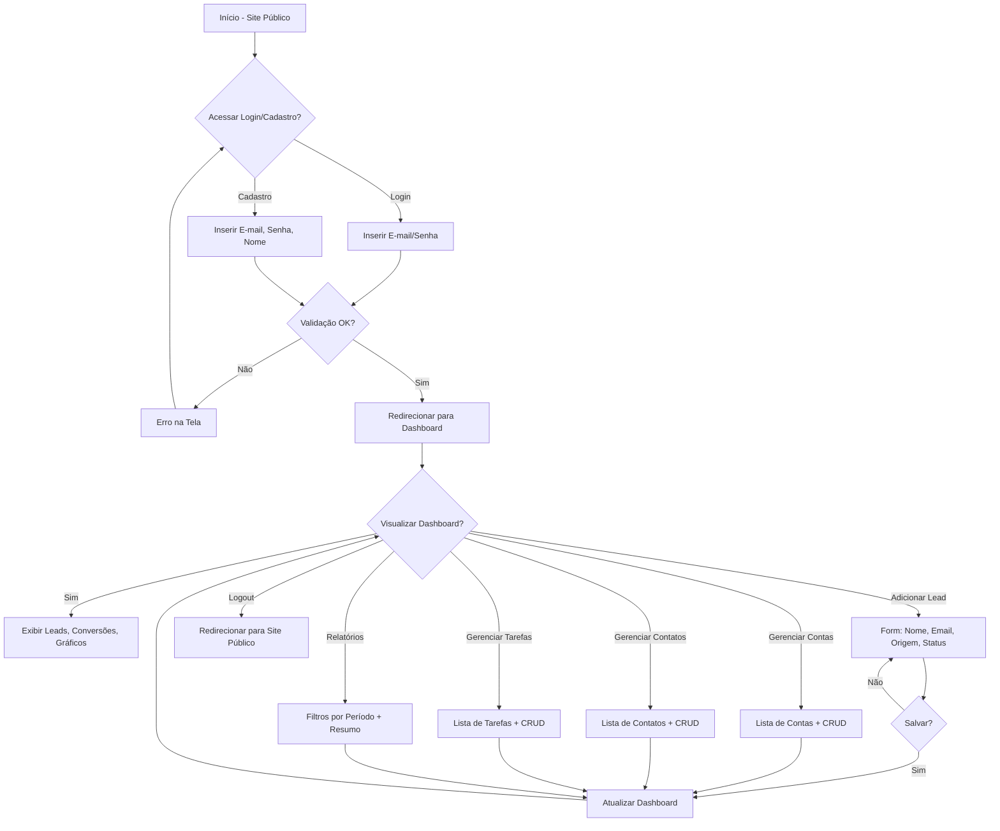
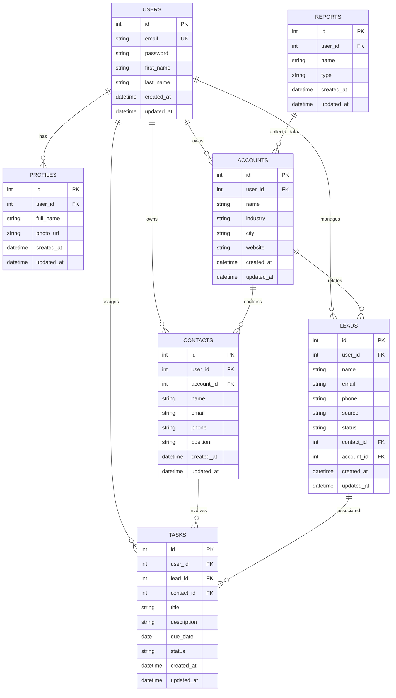

# Documento de Requisitos do Produto (PRD) - JL CRM

## Visão geral

O JL CRM é um sistema de gestão de relacionamento com clientes (Customer Relationship Management) desenvolvido com Python e Django, focado em simplicidade e usabilidade. Ele permite que usuários registrem leads, gerenciem contas e contatos, acompanhem tarefas e visualizem métricas comerciais em um dashboard intuitivo. O projeto adota uma abordagem full-stack com templates Django e TailwindCSS para um design moderno, responsivo e de tema escuro. A autenticação usa o sistema nativo do Django, com login via e-mail. O banco de dados é SQLite, e a estrutura é modularizada em apps Django para isolamento de responsabilidades. O escopo inicial é enxuto, sem Docker ou testes, priorizando funcionalidade básica.

## Sobre o produto

JL CRM é uma aplicação web para gestão comercial e relacionamento com clientes, construída para ser acessível e sem complexidades desnecessárias. Ele oferece um site público de apresentação com opções de cadastro e login, redirecionando usuários autenticados para um dashboard central. As entidades principais incluem usuários, perfis, leads, contas, contatos, tarefas e relatórios. Todo o conteúdo da interface é em português brasileiro, enquanto o código fonte é em inglês, seguindo PEP 8 e usando aspas simples.

## Propósito

O propósito do JL CRM é fornecer uma ferramenta simples e eficaz para que equipes comerciais gerenciem seus relacionamentos com clientes, promovendo processos organizados por meio de rastreamento de leads, conversões, follow-ups e visualizações básicas. Ele visa reduzir a sobrecarga cognitiva com um design consistente e intuitivo, ajudando usuários a tomarem decisões informadas sem a necessidade de ferramentas complexas ou integrações externas.

## Público alvo

- Pequenas e médias empresas (5-50 funcionários) que buscam organizar processos comerciais.
- Equipes de vendas, atendimento e pós-venda interessadas em controle básico de relacionamento.
- Gestores comerciais que precisam de visibilidade sobre pipeline e conversões.
- Usuários iniciantes em sistemas CRM, que preferem interfaces simples e em português brasileiro.
- Residentes no Brasil, devido ao foco em português e processos comerciais locais.

## Objetivos

- Permitir cadastro e login via e-mail em menos de 1 minuto.
- Oferecer um dashboard com resumo de leads, conversões recentes e métricas simples.
- Garantir que 80% das ações (cadastro de lead, criação de tarefa) sejam concluídas em 3 cliques ou menos.
- Manter o sistema leve e performático, com carregamento de páginas abaixo de 2 segundos.
- Evoluir para sprints finais com testes e containerização, mas priorizar MVP funcional.

## Requisitos funcionais

- **Autenticação**: Cadastro e login via e-mail usando Django Auth nativo. Site público com páginas de login/cadastro redirecionando para dashboard.
- **Dashboard Principal**: Após login, exibe total de leads, conversões recentes (últimas 10), gráfico de funil por estágio e métricas de tarefas pendentes.
- **Gerenciamento de Leads**: CRUD para leads (nome, email, telefone, origem, status).
- **Gerenciamento de Contas**: CRUD para empresas (nome, indústria, cidade, site).
- **Gerenciamento de Contatos**: CRUD para pessoas vinculadas a contas (nome, email, telefone, cargo).
- **Gerenciamento de Tarefas**: CRUD para atividades (título, descrição, data vencimento, status, vinculação a lead/contato).
- **Perfis de Usuário**: Extensão do modelo User com campos adicionais (nome completo, foto opcional).
- **Relatórios Básicos**: Filtros por período (mês/ano) e resumo por origem de lead e taxa de conversão.
- **Validações**: Campos obrigatórios em forms, emails únicos, datas válidas.

### Flowchart mermaid com os fluxos de UX

## Requisitos não-funcionais

- **Performance**: Páginas carregam em <2s; consultas SQL otimizadas para <100ms.
- **Segurança**: Autenticação Django nativa; CSRF e XSS protegidos; dados sensíveis (e-mails) hashed.
- **Usabilidade**: Design responsivo (mobile-first); acessibilidade básica (ARIA labels em forms).
- **Escalabilidade**: Inicialmente SQLite; modular para migração futura para PostgreSQL.
- **Manutenibilidade**: Código em apps isolados; signals em signals.py; CBVs preferenciais.
- **Idioma**: Interface 100% em PT-BR; código em inglês.
- **Compatibilidade**: Browsers modernos (Chrome, Firefox, Safari últimos 2 anos).

## Arquitetura técnica

### Stack

- **Backend**: Python 3.13+, Django 5.x (full-stack com CBVs).
- **Frontend**: Django Template Language + TailwindCSS (CDN ou estático).
- **Banco de Dados**: SQLite (padrão Django).
- **Autenticação**: Django Auth (customizado para e-mail como USERNAME_FIELD).
- **Outros**: Sem Docker/testes iniciais; signals em signals.py por app.

### Estrutura de dados com schemas em formato mermaid

## Design system

O design system é baseado em TailwindCSS, integrado via CDN nos templates base. Tema escuro com gradientes harmônicos (azul-indigo para primárias, cinza escuro para fundo). Todas as telas herdam de um template base (`base.html`) com header (logo, menu navegação, logout), sidebar (links para dashboard, leads, contas, contatos, tarefas, relatórios) e footer simples. Layout responsivo com grid flexível.

- **Cores Primárias**: 
  - Primária: `bg-gradient-to-r from-blue-600 to-indigo-700` (botões de ação).
  - Secundária: `bg-green-600` (ênfase em conversões).
  - Erro: `bg-red-600`, Sucesso: `bg-green-600`.
- **Cores de Fundo**: 
  - Fundo Principal: `bg-slate-900` (escuro).
  - Cards: `bg-slate-800` com borda `border-slate-700`.
  - Gradiente Hero: `bg-gradient-to-br from-slate-900 via-slate-800 to-slate-700`.
- **Padrão de Botões**: 
  - Primário: `<button class="bg-gradient-to-r from-blue-600 to-indigo-700 hover:from-blue-700 hover:to-indigo-800 text-white px-4 py-2 rounded-md shadow-lg transition">Salvar</button>`.
  - Secundário: `<button class="bg-slate-700 hover:bg-slate-600 text-white px-4 py-2 rounded-md">Cancelar</button>`.
- **Inputs e Forms**: 
  - Input: `<input class="w-full bg-slate-800 border border-slate-700 rounded-md px-3 py-2 text-white placeholder-gray-400 focus:outline-none focus:ring-2 focus:ring-blue-500">`.
  - Form: Wrapper com `bg-slate-800 p-6 rounded-lg shadow-md`.
- **Grids**: 
  - Layout Principal: `
` (sidebar 1 col, conteúdo 3 cols em desktop).
- **Menus**: 
  - Navbar: `<nav class="bg-slate-800 p-4 flex justify-between">` com links `text-white hover:text-blue-400`.
  - Sidebar: `<aside class="bg-slate-700 w-64 p-4">` com lista vertical `space-y-2`.
- **Fontes**: 
  - Principal: `font-sans` (system-ui via Tailwind), tamanhos: h1 `text-3xl font-bold`, body `text-base`.

Templates usam `` para Tailwind via ``.

## User stories

### Épico 1: Autenticação e Onboarding
- Como usuário novo, quero me cadastrar via e-mail para acessar o sistema.
- Como usuário existente, quero logar via e-mail para entrar no dashboard.
- Critérios de Aceite: 
  - Formulário de cadastro valida e-mail único e senha forte.
  - Login falha com credenciais inválidas, redireciona com mensagem de erro.
  - Após login, redireciona para /dashboard/.
  - Logout limpa sessão e volta ao site público.

### Épico 2: Dashboard e Visualizações
- Como usuário logado, quero ver resumo de leads e conversões no dashboard.
- Critérios de Aceite: 
  - Exibe total de leads, últimas 10 conversões em tabela.
  - Gráfico de funil (usando Chart.js básico) por estágio de lead.
  - Responsivo, atualiza em tempo real após ações.

### Épico 3: Gerenciamento de Leads
- Como usuário, quero adicionar/editar/excluir leads.
- Critérios de Aceite: 
  - Lista paginada de leads com filtro por status e origem.
  - Form com validação de email único.
  - Conversão de lead em conta e contato.

### Épico 4: Gerenciamento de Contas e Contatos
- Como usuário, quero criar contas e vincular contatos.
- Critérios de Aceite: 
  - CRUD para contas com campos de empresa.
  - Contatos associados a contas via ForeignKey.
  - Lista de contatos mostra empresa relacionada.

### Épico 5: Gerenciamento de Tarefas
- Como usuário, quero criar tarefas vinculadas a leads ou contatos.
- Critérios de Aceite: 
  - CRUD para tarefas com data de vencimento.
  - Filtros por status (pendente, concluída, cancelada).
  - Dashboard exibe tarefas vencidas.

### Épico 6: Relatórios
- Como usuário, quero filtrar relatórios por período.
- Critérios de Aceite: 
  - Tabela/resumo por origem de lead e taxa de conversão.
  - Exportação básica para CSV (opcional em sprint final).

## Métricas de sucesso

- **KPIs de Produto**: Taxa de retenção semanal >70%; Tempo médio de sessão >5min; Taxa de conversão de leads >20%.
- **KPIs de Usuário**: Número de usuários ativos (logins/mês) >30 no MVP; NPS >7/10 via feedback simples.
- **KPIs Técnicos**: Tempo de carregamento <2s (medido via browser devtools); Erros de autenticação <1%.
- **KPIs de Engajamento**: Leads cadastrados por usuário >10/semana; Tarefas criadas >5/semana.

## Risco e mitigações

- **Risco: Vazamento de dados sensíveis (e-mails, contatos)**. Mitigação: Usar autenticação Django hashed; auditoria manual de código; educar usuários sobre senhas fortes.
- **Risco: Performance lenta com SQLite em crescimento**. Mitigação: Otimizar queries com select_related; monitorar via Django debug toolbar; planejar migração para Postgres em v2.
- **Risco: Design inconsistente**. Mitigação: Template base obrigatório; revisão de PRs para adesão ao design system.
- **Risco: Atraso em sprints por over-engineering**. Mitigação: Definir escopo granular; reuniões semanais curtas; priorizar MVP sem features extras.
- **Risco: Baixo engajamento inicial**. Mitigação: Onboarding guiado; e-mails de boas-vindas; métricas semanais.

