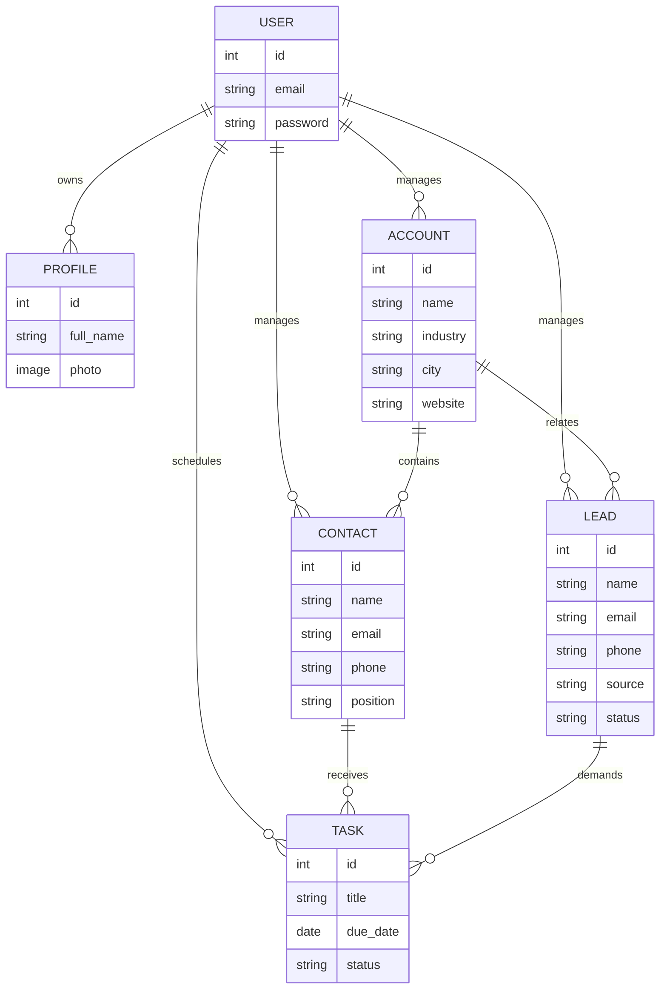

# JL CRM

Aplicação web de CRM construída com Django 5 e TailwindCSS focada em fluxos B2B. O sistema permite cadastrar contas, contatos, leads, tarefas e analisar resultados por meio de um dashboard e relatórios filtráveis.

## Requisitos mínimos

- Python 3.13+
- pip 24.x
- SQLite 3 (instalado com o Python)
- Sistema operacional com `python3` e `virtualenv`

## Instalação e execução local

```bash
git clone <repo-url> crm_django
cd crm_django
python -m venv venv
source venv/bin/activate  # ou venv\Scripts\activate no Windows
pip install -r requirements.txt
python manage.py migrate
python manage.py createsuperuser  # crie um usuário admin (opcional)
python manage.py runserver
```

### Comandos úteis

| Objetivo | Comando |
| --- | --- |
| Atualizar dependências locais | `pip install -r requirements.txt` |
| Rodar migrations futuras | `python manage.py makemigrations && python manage.py migrate` |
| Executar testes | `python -Wall manage.py test` |
| Resetar banco local | Remova `db.sqlite3` e execute `migrate` novamente |

## Estrutura do projeto

```
.
├── accounts/      # CRUD de contas (empresas)
├── agents/        # guias dos agentes Backend/Frontend/QA
├── contacts/      # CRUD de contatos ligados a contas
├── core/          # settings, urls, home e dashboard
├── docs/          # documentação complementar (apps, processos, UI)
├── leads/         # pipeline de leads e conversão
├── profiles/      # perfil automático vinculado ao usuário
├── tasks/         # tarefas vinculadas a leads/contatos
├── templates/     # templates HTML compartilhados com Tailwind
├── users/         # custom user baseado em e-mail e autenticação
├── requirements.txt
└── README.md
```

## Visão dos apps

- **users/profiles**: autenticação por e-mail e perfil criado via signal.
- **accounts/contacts**: empresas e pessoas responsáveis por cada relacionamento.
- **leads**: pipeline com status e ação de conversão que cria/relaciona contas e contatos.
- **tasks**: atividades com due date e status, exibidas no dashboard.
- **core**: home, dashboard e relatórios com filtros por período.

## Fluxo de dados (Mermaid)



## Contribuição

1. Crie um branch a partir de `main`.
2. Siga o guia em `docs/conventions.md` (PEP8, snake_case, CBVs, Tailwind).
3. Execute `python -Wall manage.py test` antes de abrir PR.
4. Atualize `docs/` e `CHANGELOG.md` quando alterar comportamento visível.

## Checklist de entrega

- [ ] Templates 100% em PT-BR.
- [ ] Arquivos estáticos (Tailwind CDN) carregando sem erros.
- [ ] Nenhum dado sensível hardcoded (senhas, tokens).
- [ ] UI consistente (cores, tipografia, responsividade).
- [ ] Projeto executa em ambiente limpo seguindo os passos acima.

## Contato

- Autor: JL CRM Squad
- E-mail: dev@jlcrm.fake (substituir pelo contato real)

Para detalhes adicionais (rotas, modelos, UI, processo) veja `docs/`.
