# Visão geral

## Propósito e missão
JL CRM é um CRM web minimalista descrito no `PRD.md`: oferece cadastro/login via Django, um dashboard simples e módulos para leads, contas, contatos, tarefas e relatórios. O objetivo é entregar visibilidade comercial sem integrações externas nem complexidade adicional.

## Público-alvo
- Pequenas e médias empresas brasileiras que precisam organizar relacionamento com clientes.
- Equipes de vendas, atendimento e gestores que acompanham pipeline e follow-ups.
- Usuários iniciantes em CRM, priorizando interface em português brasileiro e fluxos curtos.

## Escopo funcional e status
| Área | O que o PRD define | Estado no repositório |
| --- | --- | --- |
| Setup de projeto | Projeto Django 5.2.8 com apps `accounts`, `contacts`, `leads`, `reports`, `tasks`, `users` já criado. | **Concluído** – estrutura pronta, settings em PT-BR e requirements instalados. |
| Autenticação e onboarding | Cadastro/login via Django Auth nativo, login por e-mail, logout e redirecionamentos. | **Concluído** – custom user baseado em e-mail e templates Tailwind publicados. |
| Dashboard | Resumo de leads, tarefas e funil (Chart.js). | **Concluído** – cards usam dados reais, gráfico de linha mensal (leads x conversões) com metas e barras do pipeline proporcionais. |
| Leads | CRUD completo com filtros, conversão em conta/contato. | **Concluído** – filtros, conversão automática e métricas integradas ao dashboard. |
| Contas e contatos | CRUD para empresas e pessoas vinculadas. | **Concluído** – formulários com validações por proprietário e templates responsivos. |
| Tarefas | CRUD com vínculo opcional a lead/contato e destaque para atrasadas. | **Concluído** – cards de pendências/vencidas e filtros por status. |
| Relatórios | Filtros por período e agregações simples + exportação CSV opcional. | **Concluído** – `/reports/` com filtros data, agregações por origem/status e botão “Exportar CSV”. |

> Utilize este quadro para alinhar expectativas: só documentamos o que está efetivamente presente no código. Atualize o status após concluir cada sprint para manter o PRD alinhado ao repositório.

## Stack e arquitetura
- **Framework**: Django 5.2.8 (Python compatível ≥3.10), apps modularizados por domínio.
- **Banco**: SQLite (`db.sqlite3`) durante o MVP.
- **Frontend**: Templates Django com TailwindCSS via CDN, tema escuro, layout com navbar, sidebar e conteúdo responsivo.
- **Autenticação**: Django Auth padrão, previsto custom user baseado em e-mail (app `users`).
- **Hospedagem**: execução local via `manage.py runserver`; não há Docker ainda.

## Visualizações avançadas
- **Gráfico de linha mensal**: renderizado via `<svg>` e `polyline` no dashboard com os últimos 6 meses de dados (leads x conversões). Sempre compara conversões com a meta definida (`DashboardView.monthly_goal`) e mostra tabela com o delta da meta.
- **Pipeline em tempo real**: barras horizontais e colunas verticais usam `style="width: {{ percent }}%"` / `style="height: calc({{ percent }}% + 1rem)"`, garantindo proporção aos dados do usuário.
- **Exportação CSV**: `/reports/?export=csv` entrega o resultado dos filtros em um arquivo `relatorio_<data>.csv` contendo Origem, Leads, Convertidos e Taxa. As próximas extensões (sprint final) focarão em gráficos adicionais e metas customizadas.

## Fluxo principal de UX
Fluxo derivado do `PRD.md`, preservado aqui como referência para implementação de telas:

```mermaid
flowchart TD
    A[Início - Site Público] --> B{Acessar Login/Cadastro?}
    B -->|Login| C[Inserir E-mail/Senha]
    B -->|Cadastro| D[Inserir E-mail, Senha, Nome]
    C --> E{Validação OK?}
    D --> E
    E -->|Não| F[Erro na Tela]
    E -->|Sim| G[Redirecionar para Dashboard]
    F --> B
    G --> H{Visualizar Dashboard?}
    H -->|Sim| I[Exibir Leads, Conversões, Gráficos]
    H -->|Adicionar Lead| J[Form: Nome, Email, Origem, Status]
    H -->|Gerenciar Contas| K[Lista de Contas + CRUD]
    H -->|Gerenciar Contatos| L[Lista de Contatos + CRUD]
    H -->|Gerenciar Tarefas| M[Lista de Tarefas + CRUD]
    H -->|Relatórios| N[Filtros por Período + Resumo]
    J --> O{Salvar?}
    O -->|Sim| P[Atualizar Dashboard]
    O -->|Não| J
    K --> P
    L --> P
    M --> P
    N --> P
    P --> H
    H -->|Logout| Q[Redirecionar para Site Público]
```

## Referências cruzadas
- Documento de requisitos completo: `../PRD.md`.
- Requisitos técnicos do Django: `requirements.txt`.
- Ajustes pendentes destacados no PRD (ex.: `LANGUAGE_CODE` e `TIME_ZONE`) devem ser tratados assim que forem implementados.
