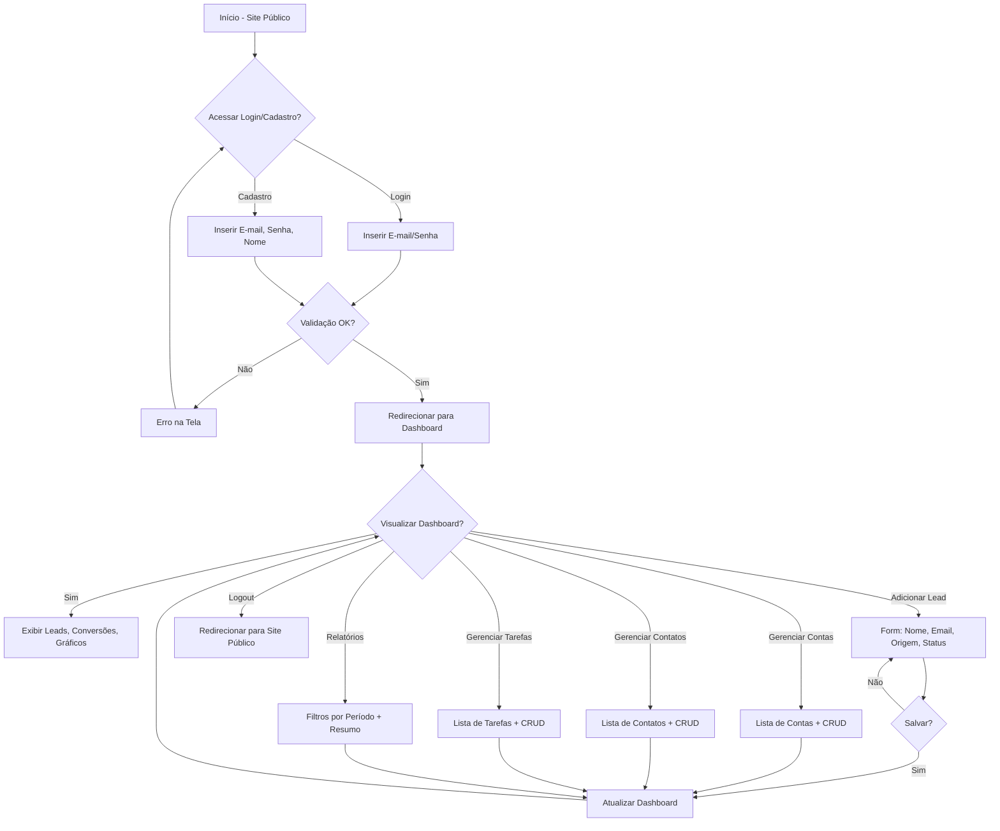

# Visão geral

## Propósito e missão
JL CRM é um CRM web minimalista descrito no `PRD.md`: oferece cadastro/login via Django, um dashboard simples e módulos para leads, contas, contatos, tarefas e relatórios. O objetivo é entregar visibilidade comercial sem integrações externas nem complexidade adicional.

## Público-alvo
- Pequenas e médias empresas brasileiras que precisam organizar relacionamento com clientes.
- Equipes de vendas, atendimento e gestores que acompanham pipeline e follow-ups.
- Usuários iniciantes em CRM, priorizando interface em português brasileiro e fluxos curtos.

## Escopo funcional e status
| Área | O que o PRD define | Estado no repositório |
| --- | --- | --- |
| Setup de projeto | Projeto Django 5.2.8 com apps `accounts`, `contacts`, `leads`, `reports`, `tasks`, `users` já criado. | **Concluído** (estrutura criada, mas apps ainda sem modelos/views).
| Autenticação e onboarding | Cadastro/login via Django Auth nativo, login por e-mail, logout e redirecionamentos. | **Pendente** (código ainda não implementado).
| Dashboard | Resumo de leads, tarefas e funil (Chart.js). | **Pendente**.
| Leads | CRUD completo com filtros, conversão em conta/contato. | **Pendente**.
| Contas e contatos | CRUD para empresas e pessoas vinculadas. | **Pendente**.
| Tarefas | CRUD com vínculo opcional a lead/contato e destaque para atrasadas. | **Pendente**.
| Relatórios | Filtros por período e agregações simples + exportação CSV opcional. | **Pendente**.

> Utilize este quadro para alinhar expectativas: só documentamos o que está previsto e/ou presente. Sempre atualize o status ao entregar novas partes do PRD.

## Stack e arquitetura
- **Framework**: Django 5.2.8 (Python compatível ≥3.10), apps modularizados por domínio.
- **Banco**: SQLite (`db.sqlite3`) durante o MVP.
- **Frontend**: Templates Django com TailwindCSS via CDN, tema escuro, layout com navbar, sidebar e conteúdo responsivo.
- **Autenticação**: Django Auth padrão, previsto custom user baseado em e-mail (app `users`).
- **Hospedagem**: execução local via `manage.py runserver`; não há Docker ainda.

## Fluxo principal de UX
Fluxo derivado do `PRD.md`, preservado aqui como referência para implementação de telas:

## Referências cruzadas
- Documento de requisitos completo: `../PRD.md`.
- Requisitos técnicos do Django: `requirements.txt`.
- Ajustes pendentes destacados no PRD (ex.: `LANGUAGE_CODE` e `TIME_ZONE`) devem ser tratados assim que forem implementados.
